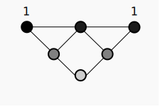
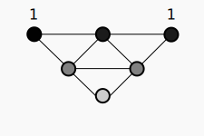

# [draft] Fields with the minimal function

## Requisite Reading

- [Minimal function](./minimal-function.md)
- [Spatial dimensions](./spatial-dimensions.md)

## Abstract

## Introduction

## Kinematics

We place the sum of the nodes within a function on a 1 dimensional axis,
labelled as 1st degree function. With the operation of
the minimal function performed on each node we can output the following
graph with "virtual" nodes to represent the extension to field
probabilities, which scale between 0 and 1 ([Fig. 10](#field1)).

*Fig. 10: Field graph*

$$
  \Sigma = \{\{ 1,1\},\{ 1,1\},\{ 1,\frac{1}{2}\},\{\frac{1}{2},1\},\{ 1,\frac{1}{2}\},\{\frac{1}{2},1\},\{\frac{1}{2},\frac{1}{4}\},\{\frac{1}{4},\frac{1}{2}\}\}
$$

For a given $\Sigma \bullet_{1}$ the parallel ([Fig. 11](#field2)) and perpendicular ([Fig. 12](#field3)) functions
will be identical. For instance both functions are the product of the
function's probabilities:

$$
  \mu_{n} = \prod_{i = 1}^{n}\frac{1}{2}
$$

*Fig. 11: Parallel function*

$$
  \mu_{2_\parallel}  = \prod_{i = 1}^{2}\frac{1}{2}  = .25  = \frac{1}{4}
$$

So the product of the 2nd degree parallel function ([Fig. 11](#field2)) of
a $2\bullet_{1}$ function is $\frac{1}{4}$.

*Fig. 12: Perpendicular function*

The product of the minimum 2nd degree perpendicular ([Fig. 12](#field3))
function is:

$$
  \mu_{2_\perp} = \prod_{i = 1}^{2}\frac{1}{2} = .25 = \frac{1}{4}
$$

As 1st degree function can be thought of as $E = pc$
and the 2nd degree perpendicular function can be
thought of as an acceleration function, I.E. $E = (pc)^{2}$.

## Tests

### Proven

### Proposed

- every field should follow the inverse square law and/or the Lorentz function