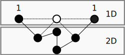

# [draft] Mass Function

## Requisite Reading

- [Fields](./fields)
- [Spatial dimensions](./spatial-dimensions)

## Abstract

## Introduction

## Kinematics

### Mass

For any hypothesis about mass we have to start with
Einstein's famous equation and Dirac's extension \cite[p.~410]{Dirac:1997aa}
which demonstrated we all contain energy:

$$
  E^{2} = {(pc)}^{2} + {(m_{0}c^{2})}^{2}
$$

We can list the function's kinematics, the function:

- Has to involve acceleration
- Has to involve energy as a derivative of the square of $c$
- Has to accommodate for momentum
- Has to demonstrate mass

### Graph representation of mass

Using the above requirements we can map the mass function out. To allow
for acceleration we have to involve a 2nd degree field
function. Effectively for each unit of mass there has to be a square of
edges/nodes. For momentum we have to include the 1st
degree field function. The minimal mass function graphed in 
[Fig. 14](#mass) is essentially $1c\  + ({2c})^{2}$

*Fig. 14: Minimal mass function*

$$
  \Sigma = \{\{ 1,1\},\{ 1,1\},\{ 1,1\},\{ 1,1\},\{ 1,1\}\} = \{\{ 1,2\},\{ 2,2\},\{ 2,1\}\}
$$

When mapped to a function field graph, we find for a function of six
nodes there is a ``gap'' for the seventh node. In an enclosed function
the first node can perform the function of the second (essentially a
loop and reduces $pc$ to 0), thus reducing from six to five nodes, and
in an open function the second node can be the first of another instance
of the mass function.

This function is similar to a complete 2st degree
field function, but is missing a node and when the probability of the
edges is $\geq 1$ but the probability of a node within the function
being available is $< 1$, to conserve its Hamilitonian probability the
function has to pull in a node from another part of the system. In most
cases it'll pull from its own function, but for a given amount of nodes
it has to pull from a donor function.

*Fig. 15: Mass interaction*

[Fig. 15](#mass2) is a visualisation of the donor system interacting with the
recipient system. To keep things simple this contribution is only considering
interactions between 2 functions, as 3 or more introduces complexity
that is out of the scope of this contribution.

$$
  \Sigma_{d} = \{\{ 1,1\},\{ 1,1\},\{ 1_{r},1\},\{ 1_{r},1\}\}
$$

$$
  \Sigma_{r} = \{\{ 1,1\},\{ 1,1\},\{ 1,1\},\{ 1,1\},\{ 1,1\},\{ 1_{d},1\},\{ 1_{d},1\}\}
$$

Please note this is a simplification of the kinematics involved, as the
mass function in reality isn't binary, the author plans to expand upon
this in another contribution. The fact this turns both functions into
hypergraphs (similar to the 2D function) is of keen interest to the
author.

*Fig. 16: Mass function constitutes of dimensional functions*

We can interpret this as a function that is derived from the 1D and 2D
functions ([Fig. 16](#mass3)):

$$
  \mu_{> 2} = {({d_{1}}^{- 1} + {d_{2}}^{- 1})}^{- 1} = \frac{d_{1}d_{2}}{d_{1} + d_{2}} =  \frac{1}{5}
$$

Thus the minimum function that will demonstrate "mass" needs a minimum of 5 nodes.
This is a 1st degree mass function, which can be
tested with the following:

$$
  \mu_{> 2}\Sigma \bullet_{1} \geq 1
$$

### Acceleration caused by the mass function

When the donor system donates a node, the beneficiary system becomes
part of the donor's acceleration function as it's perpendicular to the
donor's internal momentum function. Thus, for the donor to conserve its
own Hamilitonian probability it has to accelerate.

If we want to treat the mass function as a classical continuum, we can
translate probability to an integral. We can form the integral version
of $\mu_{> 2}$ dividing by $d_{1}$ to give us a ratio when using the 
value of $E$ on a continuum.

$$
  f_{> 2} = \int_{0}^{{\mu_{> 2}}^{-1}}\frac{x}{d_{1}} dx = \frac{1}{\mu_{> 2}}^{2}
$$

Where $f_{> 2}$ is a constant within a system where 1 or more
functions pass $\mu_{> 2}\bullet\ > 1$

If we want real world numbers we can normalise by $c$ to get
momentum-energy equivalence.

$$
  p_{> 2} = \int_{0}^{{\mu_{> 2}}^{-1}}\frac{x}{d_{1}c} dx = \frac{x^{2}}{c}
$$

And as $E$ is the area of $x$ we get:

$$
  p = \frac{E}{c}
$$

This can be interpreted as the mass function accommodating momentum,
i.e. massive objects can move in a direction.

We can normalise by $c^{2}$ to get the mass-energy equivalence:

$$
  a_{> 2} = \int_{0}^{{\mu_{> 2}}^{-1}}\frac{x}{d_{1}c^{2}} dx = \frac{x^{2}}{c^{2}}
$$

And as $E = x^{2}$ we can interpret mass being the acceleration of
energy in this function:

$$
  a_{> 2} = m = \frac{E}{c^{2}}
$$

As a function can be its own donor, thus most change caused by the mass
function will be internal momentum, a proportion of which will be
angular momentum (depending on the system).

## Tests

### Proven

### Proposed