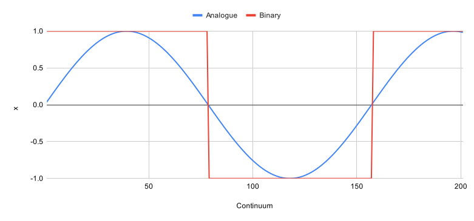
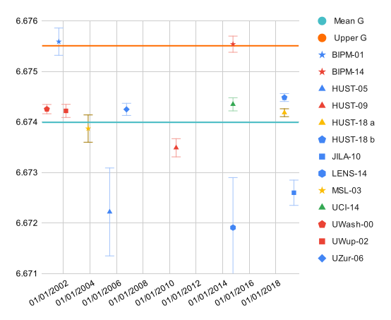

# [draft] Gravitational Constant

## Requisite Reading

- [First mass function](~/first-mass-function)

## Abstract

## Introduction

## Kinematics

### Gravitational constant

As we now have functions for dimensions and mass, we can tackle the
gravitational constant G. G represents the proportion of
$\Sigma \bullet_{1}$ a mass function summons and can't be provided by its
parent function.

We can calculate the probability that a node will definitely be outside
the 1st degree mass function with one neat trick. With
graph functions, we can shift variables across for the next degree. So
we can use 2D and 3D functions in place of the 1D and 2D functions that
define a 1st degree mass function to define the
2nd degree mass function:

$$
  \mu_{> 3} = \frac{d_{2}d_{3}}{d_{2} + d_{3}} = \frac{1}{1732}
$$

This gives the probability test of how many nodes are needed before the
2nd degree mass function requires a donor system:

$$
  \mu_{> 3}\Sigma \bullet_{1} > 1
$$

However as we treat gravity as a classical field continuum, to get close
to G we have to translate our binary probability to a continuous
integral. So we introduce the integral version of $\mu_{> 3}$ dividing
by $d_{2}$ to give us a ratio when the value of $E$ is on a continuum, just as we
did for $f_{> 2}$:

$$
  f_{> 3}=\int_{0}^{{\mu_{> 3}}^{- 1}}\frac{x}{d_{2}} dx
$$

This gives us the ratio of acceleration to energy, essentially Newtonian
gravity-energy equivalence.

We use $d_{2}$ as the 2nd degree mass function will 
pull in 4 nodes versus $d_{1}$ and the 1 node for mass-energy equivalence.

We then can calculate G by normalising the above with $c^{2}$, just as
we did with the 1st degree mass function:

$$
  G_{> 3} = \int_{0}^{{\mu_{> 3}}^{- 1}}\frac{x}{d_{2}c^2} dx = 6.6755086835... \times 10^{- 11} 
$$

We move from Newtonian gravity-energy equivalence to the more
traditional Newtonian gravity-mass equivalence.

This allows us to calculate G if the parent function is very dense, and
perfectly square ($d_{2}$) and cuboid ($d_{3}$). Definite integrals
of $G_{> 3}$ are shown in (\ref*{eq:43}):

$$
  G_{> 3} = \frac{{d_{2}}^{- 1}({d_{2}}^{- 1}+{d_{3}}^{- 1})^{2}}{2c^2}  = \frac{4(4+1728)^{2}}{2c^2}
$$

### Mean at scale

Through observations and the fact that G is very hard to pin down
experimentally, and as we don't live in a square and binary world, we
can assume G will vary due to the shape and composition of matter (it's own wave function).

As G varies due to the "shape" of the system (and to other functions
within larger systems). $d_{2}$ and $d_{3}$ assume the material is
perfectly square or cuboid respectively,
but experiments for G are not, so we have to approximate the boundary
that functions may have at the scale the experiments are situated in. 
Figure~\ref*{fig:chart2} illustrates the differences in approach if 
the system is mapped to a wave function.

*Fig. C2: Analogue vs. binary*

One possible approximation is to take the excircle or exsphere to reduce
the system $d_{2}$ and $d_{3}$ to the incircle and insphere,
$\frac{\pi}{4}$ and $\frac{\pi}{6}$ respectively.

This line of thinking is also reminiscent of when the energy-mass
relationship was being discovered at the turn of the
20th century, where Hasenöhrl \cite[p.~1039]{kaiserl1904sitzungsberichte} 
proposed the "charge mass" equation for charged bodies was:

$$
  E  = \frac{8}{3}mc^{2}
$$

So it may be that $G_{> 3}$ is the correct interpretation for the
2nd degree mass function, and other functions
contribute to the distribution of measured gravitational constants, but
for the time being let us explore this idea of fuzziness.

### Mean 2D function

Due to a field's boundary possibly being determined by probability, the
larger the system the greater the boundary probabilities impact the
system. Thus a 2D field at scale will form a circle rather than a
square. To approximate this transformation we can subtract
$\frac{\pi}{4}$:

$$
  \mu_{2\pi} = \frac{{d_{2}}^{- 1}}{{d_{2}}^{- 1}d_{2}} - \frac{\pi}{4}
$$

### Mean 3D function

For 3D matter we do the same, but we remove the exsphere by subtracting
$\frac{\pi}{6}$:

$$
  \mu_{3\pi} = \frac{{d_{3}}^{- 1}}{{d_{3}}^{- 1}d_{3}} - \frac{\pi}{6}
$$

### Calculated mean gravitational constant

To mean the gravitational (not so) constant we substitute
${\mu_{2}}^{- 1}$ and ${\mu_{3}}^{- 1}$ from $G_{> 3}$ with the
functions above. We can now work out the proportion of mass that will
enact as a gravitational force, taking into account boundary
probabilities, thus a mean G can be calculated:

$$
  G_{> 3\pi}  = \frac{{d_{2}}^{- 1}({{\mu}_{2\pi} + \mu_{3\pi}}^{2})}{{2c}^{2}} = 6.6739928853... \times 10^{- 11}
$$

Comparison between $G_{> 3}$ and $G_{> 3\pi}$ shows the boundary
probabilities has a significant impact ($\sim 1.5 \times 10^{- 14}$)
on the value of G but hopefully it is of value to gravitational constant
experimenters to consider that the "shape" of their machines may have
an impact on the results.

Though note, as with Newtonian theory, this will work well for 2 body
systems, and for systems that only pass the following test:

$$
  d_{4}\Sigma \bullet\  < 1
$$

Which is massive and pretty much incompasses all known single bodies
observed in the universe. If higher degree mass functions can be taken
into account, their contribution to G seems to be \textless{}
$5 \times 10^{- 16}$ which is close to the uncertainty of our current
macro-level experiments.

### Dimensional analysis

Another test to see if this hypothesis holds a possible foothold in reality
is to do some dimensional analysis. G is $N\cdot m^{2}\cdot kg^{-2}$ ,
and N is $kg\cdot m/s^2$ so we have
$m^{3}\cdot kg^{-1}\cdot s^{-2}$ for G:

$$
  G = \frac{\frac{1}{d_{2}}(\frac{1}{d_{2}}+\frac{1}{d_{3}})^{2}}{{2c}^{2}}
$$

$$
  = \frac{\frac{1}{x}a^{2}}{{2c}^{2}}
$$

$a$ is essentially normalised density, using the unit
$\frac{1}{\frac{kg}{m}}$ thus:

$$
  = \frac{1}{\frac{kg}{{m \cdot \left( \frac{m}{s} \right)}^{2}}}
$$

$$
  = \frac{m^{3}}{kg \cdot s^{2}}
$$

### Comparison with measured constant

This is an oversimplification of a system that contains complex detail.
This is possibly one of the reasons why G differs so much in
measurement. Also $G_{> 3}$ and $G_{> 3\pi}$ assume a 2 body system
(3 or more bodies adds further complexity, something that will be
covered in a later paper). Thankfully the experiments that include a
torsion balance (and variations of it) creates a gravitational system
which is a near enough simulation to a 2 body system.

*Fig. C1: Measurement of G post 2000*

(Figure~\ref*{fig:chart}) is a graph that plots the most recent (post 2000) gravitational
constant experiments alongside upper G ($G_{> 3}$) and mean G
($G_{> 3\pi}$).

$G_{> 3}$ may be the upper limit of G (in euclidean spacetime), as
when reviewing the recent (post 2000) gravitational constant experiments
\cite{10.1093/nsr/nwaa165} there are currently none that significantly go above
$6.6755... \times 10^{- 11}$. $G_{> 3\pi}$ may tentatively be the
mean for macro level experiments. The
extraneous results from "Fabry--Pérot cavity" (Figure~\ref*{fig:chart}:JILA-10) 
and "atom interferometry" (Figure~\ref*{fig:chart}:LENS-14) may be 
inline with this hypothesis due to their abnormal density distribution, but the author will defer to
a future paper to explore that claim. HUST-05 (the correction to
HUST-99) and HUST-09 seem to be outliers and need further investigation
as to why, though the latest HUST \cite{10.1093/nsr/nwaa165} results are within
calculated G.

The author hasn't included the 2022 gravitational constant measurement
\cite{Brack:2022aa} due to it's novel model in measuring G and extraordinary
result of $6.821(71) \times 10^{- 11}$ . It may appear in later
revisions if the same type of experiments bear a more precise and
accurate result.

## Tests

### Proven

### Proposed