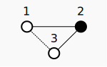
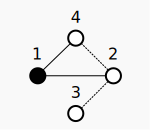
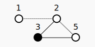
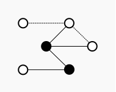
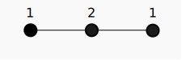

# [Draft] The Minimal Function

## Requisite Reading

## Abstract

## Introduction

In discussing the author's approach he wanted to build something
from primary concepts, and started with an analogy of the quantum action
which the author has dubbed the "Minimal Function". This represents the 
minimum quanta of energy $f(1c)$ and it's subsequent transformation 
within it's system. 

For the purposes of this contribution the Minimal Function is binary,
though on further exploration it has shown to be quite complex. For the
scope of this contribution there is no need to dive into this complexity.

A System is where a multiple of Functions can be employed. Just as a
Function uses probability to determine its state, the same can be
applied to a System. There is no boundary between a System or a
Function, just that one defines the other, so the "Minimal" function
explained here can admittedly be something of a misnomer as it is
possible to reduce complex systems into simple functions as the Path
Integral famously demonstrates, this is how the minimal function was
arrived at.

## Kinematics

The Minimal Function is a metric graph of 2 nodes with an edge
representing probability of 1. [Fig. 1](#fig1) is a graph of the initial state:

*Fig. 1: Initial State*

$$
\Sigma\  = \lbrace \bullet_{1}, \circ_{2} \rbrace
$$
 
To represent the binary state of each node we subvert the graph
algebraic notation thus:

$$
\Sigma\  = \lbrace 1_{1},0_{2} \rbrace  = 1
$$

Once the function has operated as represented by [Fig. 2](#fig2), the system still has a total
probability of 1, but the edges have $\frac{1}{2}$:

*Fig. 2: Final State*

$$
  e_{a} = \lbrace 0_{1},1_{2} \rbrace
$$

$$
  e_{b} = \lbrace 1_{2},0_{3} \rbrace
$$

$$
  \mu_{\bullet} = \frac{\Sigma \bullet}{n} = \frac{1}{2}
$$

$$
 \Sigma = \mu_{a} + \mu_{b} = 1
$$

We distribute the probability to each edge. Thus edges
$e_{a}$ and $e_{b}$ still account for intrinsic
probability of 1 for the function. This reflects the law of conservation
as there is no information loss performing the operation. The operation
has been separated into two for the ease of communication, no time (or
movement) is associated with the order of operation.

The dotted line is clarification that this is an enclosed system and
is effectively 0:

$$
  e_{c} = \lbrace 0_{1},0_{3} \rbrace = 0
$$

State A ([Fig. 3](#fig3)) and state B ([Fig. 4](#fig4)) are examples of possible iterations.

*Fig. 3: State A*

*Fig. 4: State B*

As this system is isolated, both A ([Fig. 3](#stateA)) and B ([Fig. 4](#stateB)) effectively have identical
properties, therefore no discernable comparison can be made:

$$
  \Sigma_{A} =  \lbrace \lbrace 1_{1},0_{2} \rbrace ,\lbrace 1_{1},0_{4} \rbrace \rbrace\  = \Sigma_{B} =  \lbrace \lbrace 1_{3},0_{1} \rbrace , \lbrace 1_{3},0_{2}\rbrace \rbrace  = 1
$$

## 2 Function System

For a system to demonstrate change it needs to include a partner
function. [Fig. 5](#2f) is an example of such a system.

*Fig. 5: 2 Function System*

$$
  \Sigma = \lbrace \lbrace \lbrace 1 , 0 \rbrace,\lbrace 1 , 0 \rbrace \rbrace ,\lbrace \lbrace 1 , 0 \rbrace , \lbrace 1 , 0 \rbrace \rbrace \rbrace  =  2
$$

The potential probability of a system is calculated by the product
of all edge probabilities:

$$
  \Pi = \lbrace \lbrace \frac{1}{2}\rbrace,\lbrace \frac{1}{2}\rbrace,\lbrace \frac{1}{2} \rbrace , \lbrace \frac{1}{2} \rbrace \rbrace  = \frac{1}{16}
$$

Taking state C or D from [Fig. 5](#2f) illustrates the relative change of
the partner system.

*Fig. 6: State C*

*Fig. 7: State D*

State C ([Fig. 6](#stateC)) effectively becomes a single isolated function so the potential
probability $\kappa$ is reduced to 0 while state B ([Fig. 7](#stateD)) demonstrates a
potential \(> 0\):

$$
  \kappa_{state\ A}\  = 0
$$

$$
  \kappa_{state\ B} = \frac{1}{16}
$$

The intrinsic probability for both states is 2.

This shows a discernible contrast between the 2 functions which allows
for investigation.

The operation of an isolated function has been diagrammed above for
ease, a more accurate graph for a binary cycle is shown in [Fig. 8](#graph).

*Fig. 8: Binary Cycle*

Though for visualisation of a function, the author has found
repeating the first node to represent a loop or repeat/continuation is
more suitable [Fig. 9](#graph2), as the functions discussed in this contribution 
only rely on the sum of nodes to give rise to the kinematics.

*Fig. 9: Binary Cycle*

[Fig. 9](#graph2) demonstrates where $\mu > 1$, determining
vectorisation of edges or locality of individual nodes is not possible
and for velocity or location to be determined a relative function has to
be present.

To normalise into real world values we can use the nodes to represent
momentum $p$, edges to represent the speed of light $c$ and the area
of the edges/nodes represent $E$. Using Dirac's derivative for 1
dimensional wave function we arrive at:

$$
  E = pc
$$

Effectively a 1+1 dimensional function is an intrinsic momentum function.

## Tests

### Proposed

- All known physical interactions should stem from this function
- Minimal entropy?
- Recession velocities of planetary objects?